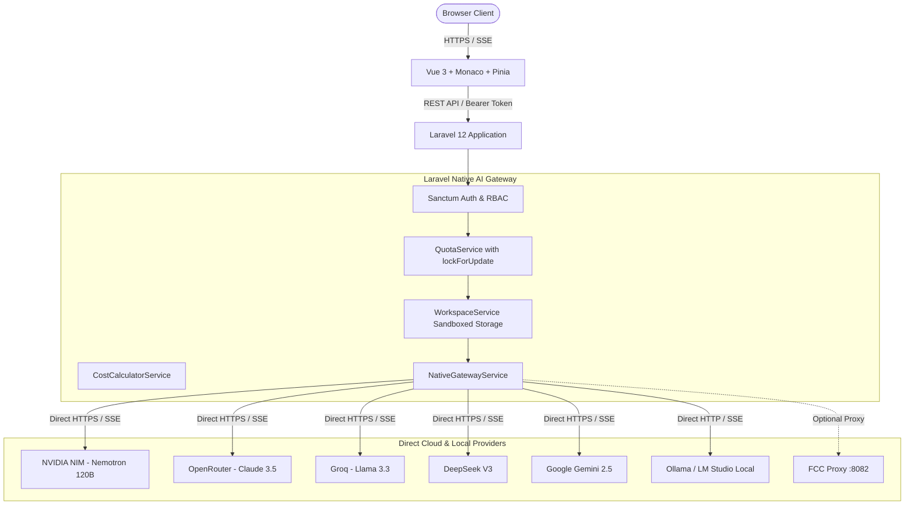

# AI Coding Workspace (Multi-User)

> A modern, browser-based multi-user AI coding workspace with a **100% Native PHP / Laravel AI Gateway** connecting directly to cloud providers (NVIDIA NIM, OpenRouter, Groq, DeepSeek, Google Gemini) and local offline LLMs (Ollama, LM Studio). Zero background terminal or Python process required!

[-emerald.svg)](#automated-testing)
[](https://vuejs.org)
[](https://laravel.com)
[](https://microsoft.github.io/monaco-editor/)
[](https://tailwindcss.com)

---

## 📖 Overview

The **AI Coding Workspace** delivers an Antigravity / Cursor-like browser development experience without requiring users to install terminals or local CLIs. It enables software teams, developers, and students to run autonomous coding agents, stream code generation in real-time, inspect files with syntax highlighting, and analyze multi-file projects with strict token quota management and enterprise cost controls.

### ⚡ 100% Native Laravel Direct AI Gateway
Previously, running AI models required maintaining an external Python FastAPI proxy daemon in a terminal (`fcc-server`), which suffered from Python 3.14+ version mismatches on Linux/Armbian and consumed RAM.

**Now, the engine runs 100% natively in Laravel (PHP):**
- **Zero background terminal processes**: Handled entirely through standard PHP-FPM / Nginx.
- **Direct upstream connections**: Laravel connects directly to NVIDIA NIM, OpenRouter, Groq, DeepSeek, Google Gemini, Ollama, and LM Studio using native cURL SSE streaming.
- **Web Admin Management**: Set API keys, base URLs, priorities, and run live ping health checks entirely from the browser at `/admin/providers`.
- **Optional FCC Proxy Support**: Retains full compatibility with legacy Free Claude Code proxies (`http://127.0.0.1:8082`) if desired.

---

## ⚡ Key Features

### 1. Web-Based Coding Workspace (Antigravity Experience)
- **Monaco Code Editor**: Full-featured code editor with syntax highlighting for 50+ languages, file tree navigation, tabbed document editing, and line-level changes.
- **Realtime SSE Streaming**: Real-time server-sent events with interactive typing animations, Markdown parsing, and a dedicated **"Stop Generation"** cancellation trigger.
- **Multi-File Context Injection**: Attach workspace files or active editor code directly into agent prompts with token-budgeted truncation.
- **Custom AI Instructions**: Per-user system instruction customization (e.g. strict TypeScript style, functional paradigms) automatically injected into model prompts.

### 2. Multi-User Authentication & Authorization
- **Dual Role System**: Separate permission gates for standard `user` and `admin` portals.
- **Account Lifecycles**: Instant registration, email verification, password update, and immediate account suspension capabilities.
- **Security Throttling**: IP and email-based login rate limiting, path traversal guards (`..` rejection), and dangerous file upload blocking (`.exe`, `.sh`, `.bat`, etc.).

### 3. Tiered Plans & Atomic Quota Controls
- **User Groups / Plans**: Four pre-configured tiers (**Free**, **Standard**, **Developer**, **Premium**) controlling monthly token caps, daily token caps, max projects, concurrent sessions, and requests per minute (RPM).
- **Concurrency & Race Condition Defense**: Token deductions and limits are wrapped inside atomic database transactions using `DB::table()->lockForUpdate()`.
- **Dynamic Cost Accounting**: Per-model configurable pricing per 1 million tokens (`input`, `output`, `cached`, `reasoning`).

### 4. Resilient Fallback Chains & Multi-Provider Architecture
- **Direct Cloud & Local Providers**: Native integration with NVIDIA NIM (Nemotron 120B default), OpenRouter (Claude 3.5 Sonnet / Haiku), Groq (Llama 3.3 70B), DeepSeek (V3 Chat), Gemini 2.5, and local offline models (Ollama, LM Studio).
- **Automated Fallbacks**: Configurable fallback model chains automatically attempt secondary providers if an upstream provider experiences downtime or rate limits.
- **Encrypted Provider Credentials**: Upstream provider API keys are encrypted at rest using AES-256 (`Crypt::encryptString`).

### 5. Coding Agent Harnesses
Pre-configured autonomous coding agent harnesses:
- **Claude Code**: Multi-file code generation and architectural refactoring.
- **Codex**: Rapid script synthesis and snippet expansion.
- **OpenCode**: Distributed open-weights architecture assistant.
- **Pi**: Deep reasoning and mathematical algorithmic agent.
- **Cline**: Autonomous autonomous task harness.
- **Hermes, DeepSeek Harness, Grok Build, Muse Code, Aider**.

### 6. Developer REST API (v1)
- Full external programmatic access (`/api/v1/chat`, `/api/v1/models`, `/api/v1/usage`, `/api/v1/projects`).
- Secure API key generation with SHA-256 hashed storage, key rotation, revocation, and granular permission scopes (`chat`, `models.read`, `projects.read`, `usage.read`).

### 7. Comprehensive Administrator Portal
- **Dashboard**: Real-time KPI summary (Active Users, Requests, Tokens, Costs), interactive Chart.js time-series timeline, and top users table.
- **User Management**: Search, filter, edit quota limits, inject bonus tokens, suspend/activate accounts.
- **Plans & Groups**: Live tier configuration (token caps, rate limits, storage limits).
- **Provider & Health Monitor**: One-click direct ping health checks for all AI gateways with live latency reporting.
- **Model Pricing Matrix**: Real-time token price editor and fallback chain selector.
- **Audit Logs**: Full security audit trail tracking user logins, password changes, quota updates, and administrator actions.
- **Exporting**: One-click streaming CSV export of all AI usage logs.

---

## 🏗️ System Architecture



---

## 🚀 Getting Started

### Prerequisites
- **PHP 8.2, 8.3, or 8.4** with `pdo_sqlite` or `pdo_mysql`, `curl`, `mbstring`, `openssl`
- **Composer** (v2.x)
- **Node.js** (v18+) & **npm**
- *(No Python required!)*

---

### Step 1: Clone or Pull the Repository
```bash
git clone https://github.com/Igustisultanh12/agen.git
cd agen
```

---

### Step 2: Install Dependencies
```bash
# Install PHP dependencies
composer install

# Install Frontend dependencies
npm install
```

---

### Step 3: Configure Environment
```bash
cp .env.example .env
php artisan key:generate
```

Configure `.env` for your database:
```env
DB_CONNECTION=mysql
DB_HOST=127.0.0.1
DB_PORT=3306
DB_DATABASE=ai_site
DB_USERNAME=ai_site
DB_PASSWORD=your_password
```

---

### Step 4: Run Migrations and Seeders
```bash
# Creates all tables, user groups, AI providers, models, pricings, and demo accounts
php artisan migrate:fresh --seed
```

#### Pre-seeded Default Accounts:
| Role | Email | Password | Monthly Token Limit |
|---|---|---|---|
| **Admin** | `admin@example.com` | `admin123456` | Unlimited |
| **Demo User** | `user@example.com` | `user123456` | 10,000,000 tokens |

---

### Step 5: Build Frontend Assets
```bash
npm run build
```

---

### Step 6: Configure Your AI Keys in Admin UI
Open your browser to:
**`http://your-server-ip:1265/login`** (or `http://localhost:8000/login`)

1. Login as Admin (`admin@example.com` / `admin123456`).
2. Navigate to **AI Providers** (`/admin/providers`).
3. Click **Edit** on your chosen provider (e.g. **NVIDIA NIM**, **OpenRouter**, or **Groq**).
4. Paste your API Key and click **Save Provider**.
5. Click **Ping Test** — you'll immediately see green `Healthy` with the latency in ms!
6. Go to **Workspace** (`/workspace`) and start coding!

---

## 🧪 Automated Testing

The platform includes a test suite covering Authentication, atomic Quota consumption, Workspace filesystem isolation, Path Traversal protection, Native Gateway routing, and the External API:

```bash
php artisan test
```

### Test Results:
```
Tests:    29 passed (105 assertions)
Duration: 1.28s
```

---

## 🛡️ Security & Privacy Architecture

- **Path Traversal Protection**: Every file access is strictly resolved against the project workspace folder (`storage/app/workspaces/{uuid}/`) using canonical path checking. Any request containing `..` or leading slashes outside the sandbox is rejected with `422 Unprocessable Content`.
- **MIME & File Extension Enforcement**: Disallowed extensions (`.exe`, `.dll`, `.bat`, `.cmd`, `.sh`, `.ps1`, `.vbs`) are permanently blocked from upload and creation.
- **Credential Encryption**: Upstream AI Provider keys are never saved in plaintext; they are encrypted via Laravel's AES-256 encryption (`Crypt::encryptString`).
- **External API Tokens**: User API keys are generated as random 40-character tokens (`fcc_...`), and only the cryptographic SHA-256 hash is persisted in the database.

---

## 📄 License & Attribution
- Licensed under the [MIT License](LICENSE).
- Attribution and inspiration from [Free Claude Code](https://github.com/Alishahryar1/free-claude-code) by [Alishahryar1](https://github.com/Alishahryar1).
